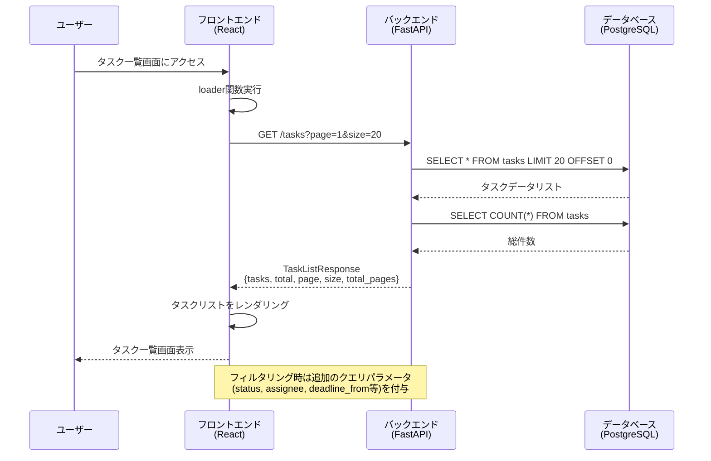
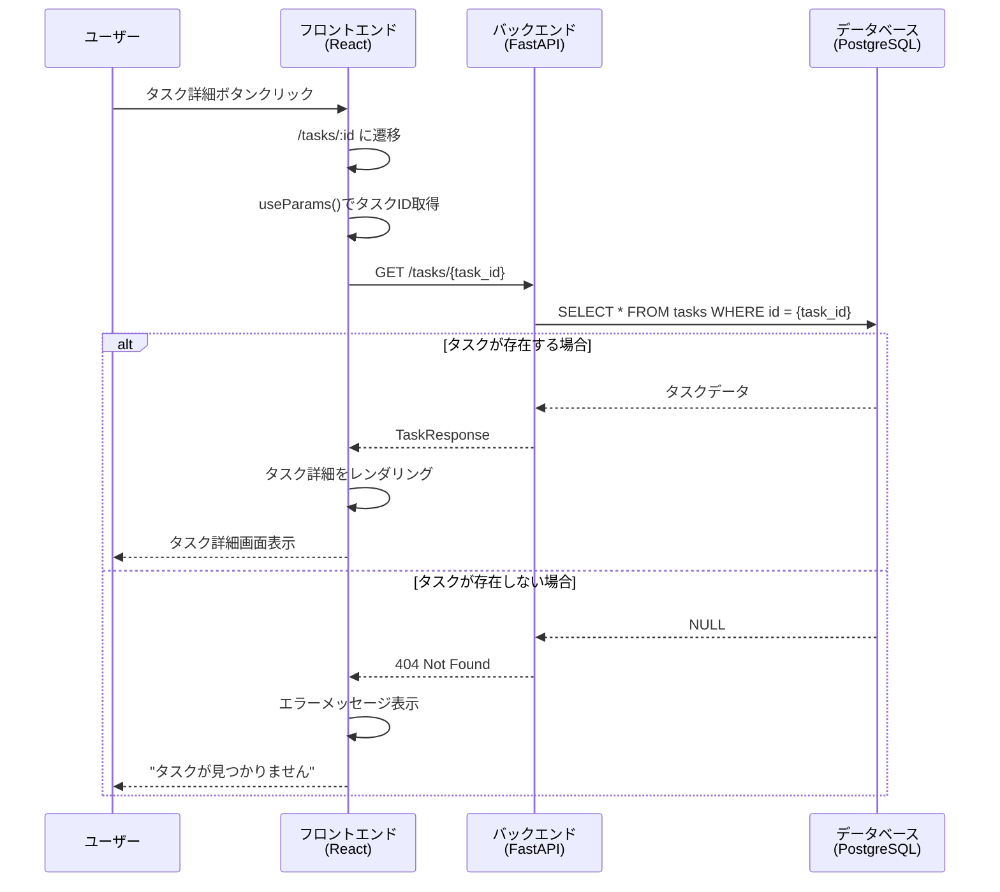
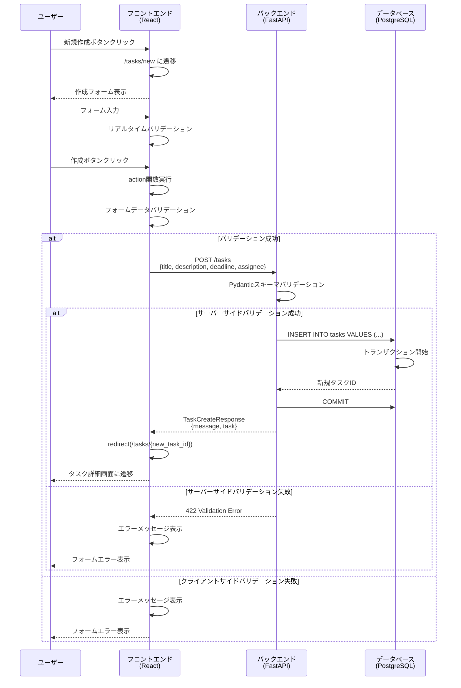
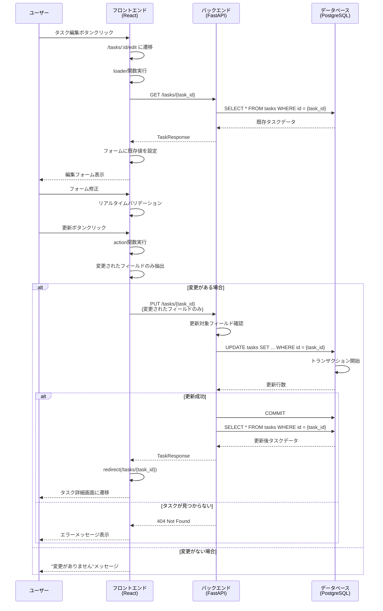
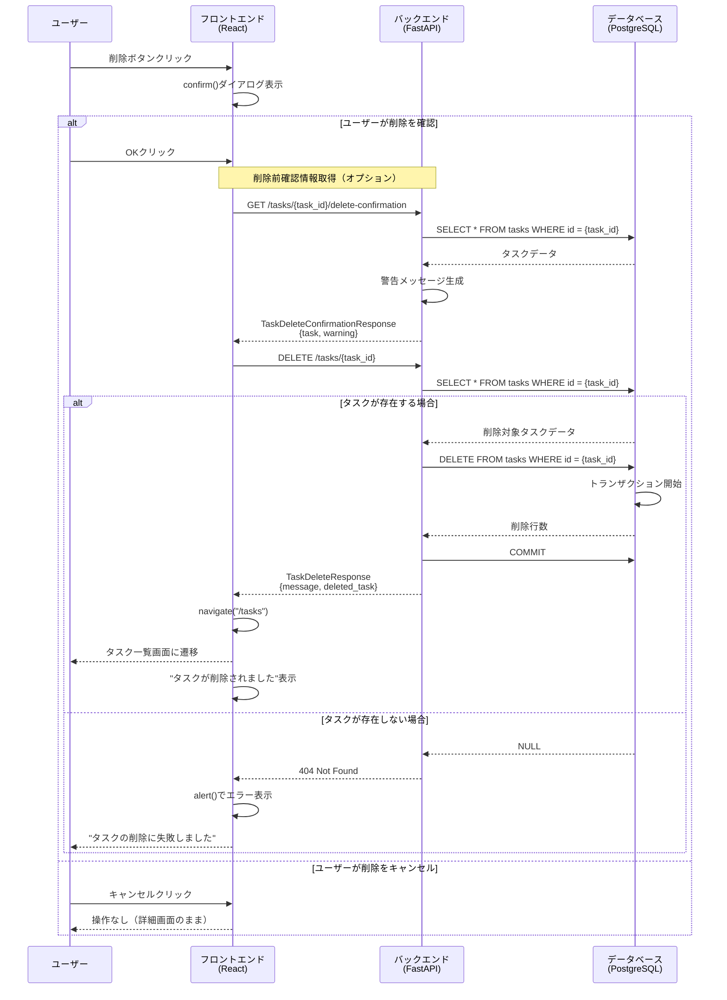
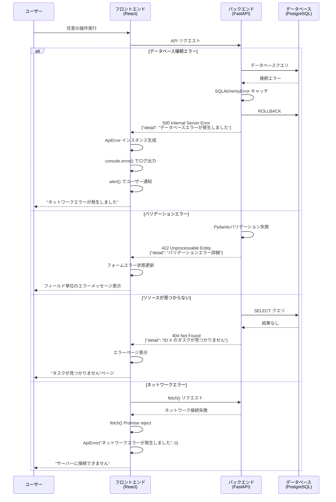
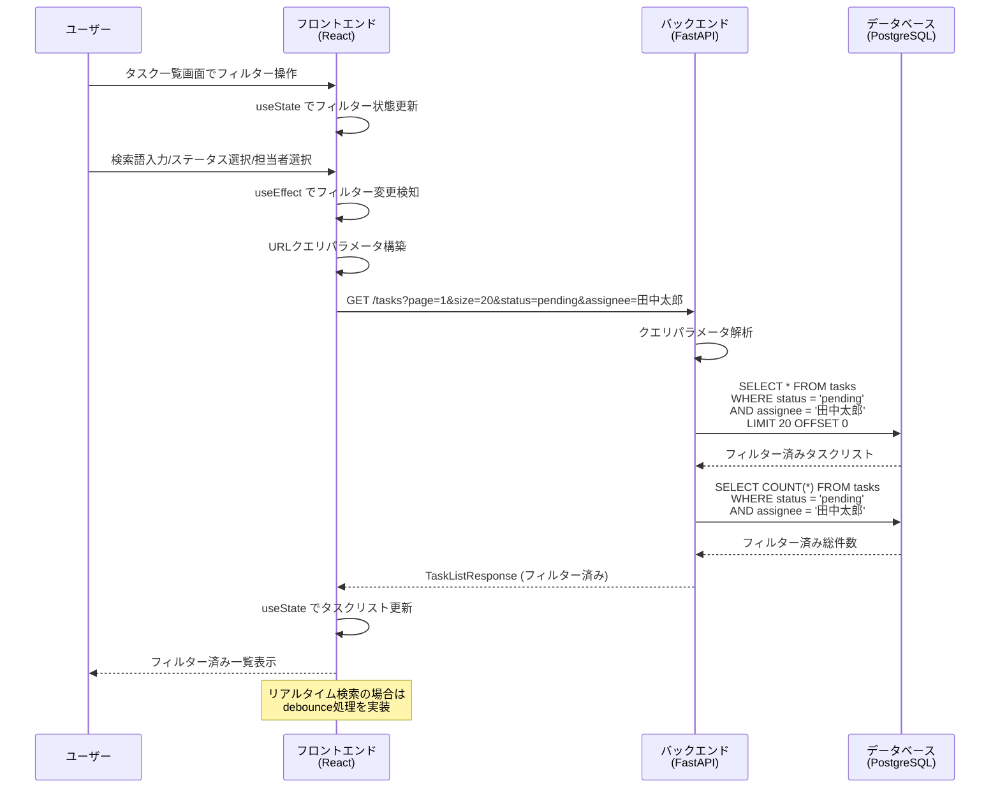

# シーケンス図

## 概要
タスク管理アプリケーションの主要な操作フローにおける、フロントエンド・バックエンド・データベース間の処理シーケンスを図示します。

## 1. タスク一覧表示シーケンス

## 2. タスク詳細表示シーケンス

## 3. タスク作成シーケンス

## 4. タスク更新シーケンス

## 5. タスク削除シーケンス

## 6. エラーハンドリングシーケンス

## 7. フィルター・検索シーケンス

## 技術的な詳細

### 1. トランザクション管理
- データベース操作はトランザクション内で実行
- エラー発生時は自動ロールバック
- 成功時のみコミット実行

### 2. エラーハンドリング階層
1. **データベース層**: SQLAlchemy例外をキャッチ
2. **アプリケーション層**: ビジネスロジック例外をHTTPExceptionに変換
3. **API層**: HTTPExceptionをJSONレスポンスに変換
4. **フロントエンド層**: APIエラーをユーザー向けメッセージに変換

### 3. レスポンシブ処理
- API呼び出し中はローディング状態表示
- `useNavigation()` フックで遷移状態を管理
- ユーザー操作の重複実行を防止

### 4. データ同期
- フォーム送信後はサーバーから最新データを取得
- 楽観的更新は実装していない（安全性を重視）
- キャッシュ機能は現在未実装

### 5. セキュリティ考慮事項
- SQL インジェクション対策：ORMによるパラメータ化クエリ
- XSS 対策：Reactの自動エスケープ機能
- CSRF 対策：現在未実装（将来の拡張課題）