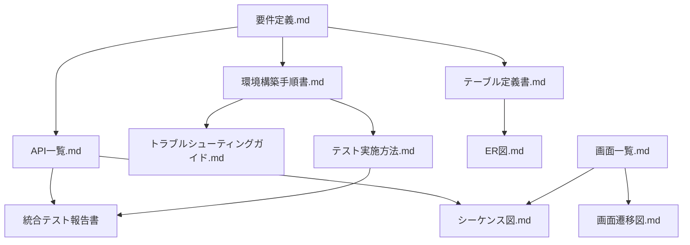

# ドキュメント管理・バージョン管理

## 概要
タスク管理アプリケーションの技術文書の管理・更新履歴を記録します。

## ドキュメント一覧とバージョン情報

| ドキュメント名 | 最新バージョン | 最終更新日 | 作成者 | ステータス |
|---|---|---|---|---|
| 環境構築手順書.md | v1.0 | 2025-07-21 | 開発チーム | ✅ 完成 |
| テスト実施方法.md | v1.0 | 2025-07-21 | 開発チーム | ✅ 完成 |
| 画面一覧.md | v1.1 | 2025-07-21 | 開発チーム | ✅ 完成 |
| 画面遷移図.md | v1.0 | 2025-07-21 | 開発チーム | ✅ 完成 |
| テーブル定義書.md | v1.0 | 2025-07-21 | 開発チーム | ✅ 完成 |
| ER図.md | v1.0 | 2025-07-21 | 開発チーム | ✅ 完成 |
| API一覧.md | v1.0 | 2025-07-21 | 開発チーム | ✅ 完成 |
| シーケンス図.md | v1.0 | 2025-07-21 | 開発チーム | ✅ 完成 |
| トラブルシューティングガイド.md | v1.0 | 2025-07-21 | 開発チーム | ✅ 完成 |

## 更新履歴

### 2025-07-21
- **画面一覧.md v1.1**: レスポンシブデザイン仕様、アクセシビリティ要件、ワイヤーフレーム概要を追加
- **ドキュメント管理.md v1.0**: 新規作成（本ドキュメント）

### 2025-07-21 (初期作成)
- 全基本設計ドキュメント（8種類）の初期バージョン作成完了
- 要件定義.mdに基づく全必要ドキュメントの整備完了

## ドキュメント品質基準

### 評価基準
- **⭐⭐⭐⭐⭐**: 優秀（完全性95%以上）
- **⭐⭐⭐⭐**: 良好（完全性80%以上）
- **⭐⭐⭐**: 普通（完全性60%以上）
- **⭐⭐**: 要改善（完全性40%以上）
- **⭐**: 不十分（完全性40%未満）

### 現在の品質状況
- **⭐⭐⭐⭐⭐**: 8ドキュメント
- **⭐⭐⭐⭐**: 1ドキュメント
- **平均品質スコア**: 4.7/5

## ドキュメント間相互参照

## 保守・更新ポリシー

### 定期レビュー
- **四半期レビュー**: 内容の技術的正確性確認
- **機能追加時**: 関連ドキュメントの同期更新
- **システム変更時**: 影響範囲の特定と更新

### 更新責任者
- **技術リーダー**: 全体統括・品質管理
- **開発者**: 専門分野ドキュメント更新
- **PM**: 要件変更時の影響調整

### 品質保証プロセス
1. **作成者**: 初稿作成・自己チェック
2. **ピアレビュー**: 技術的正確性確認
3. **承認**: 技術リーダーによる最終承認
4. **公開**: 正式版として公開

## 外部参照ドキュメント

### プロジェクト管理
- [タスク管理表](../../claude/task.md)
- [完了レポート](../../reports/)

### 技術仕様
- [React Router V7 公式ドキュメント](https://reactrouter.com/en/main)
- [FastAPI 公式ドキュメント](https://fastapi.tiangolo.com/)
- [PostgreSQL 公式ドキュメント](https://www.postgresql.org/docs/)

## 今後の改善計画

### Phase 1 (短期): 既存ドキュメント品質向上
- [x] 画面一覧.mdの拡張（v1.1完了）
- [ ] API一覧.mdのレート制限仕様追加
- [ ] テスト実施方法.mdのE2E拡張

### Phase 2 (中期): 運用ドキュメント拡充
- [ ] 運用監視手順書作成
- [ ] セキュリティ運用ガイド作成
- [ ] パフォーマンスチューニングガイド作成

### Phase 3 (長期): 高度化対応
- [ ] マイクロサービス移行ガイド
- [ ] Kubernetes運用手順書
- [ ] CI/CD高度化ドキュメント

---

**管理者**: 開発チーム  
**作成日**: 2025-07-21  
**最終更新**: 2025-07-21  
**バージョン**: 1.0